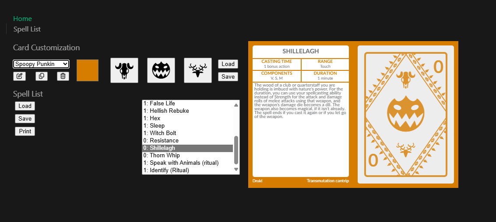
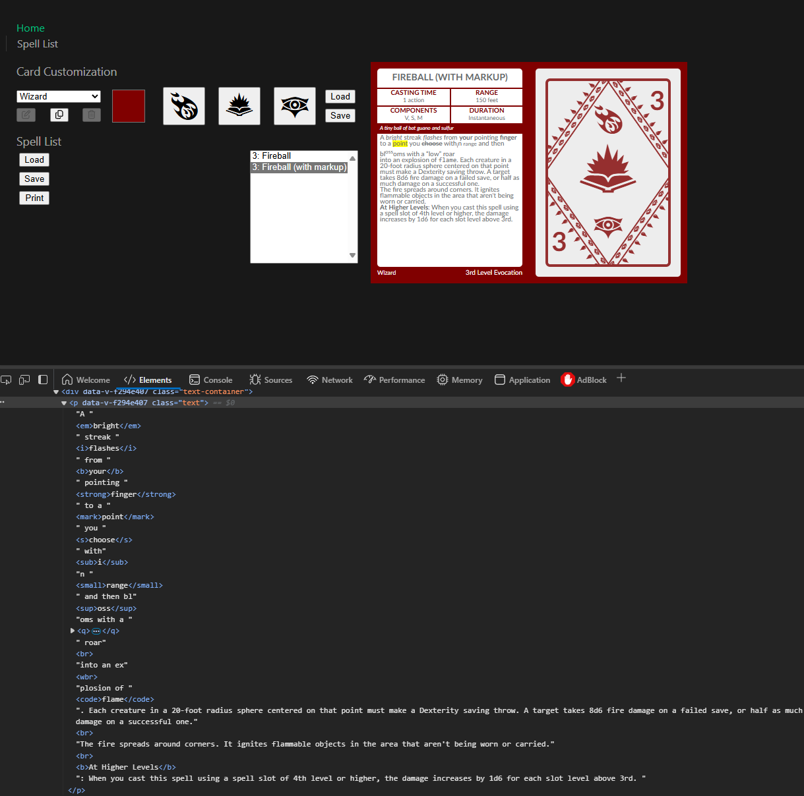
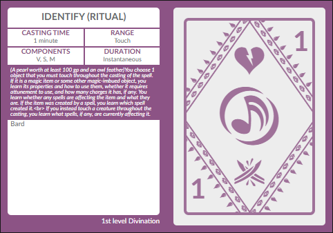
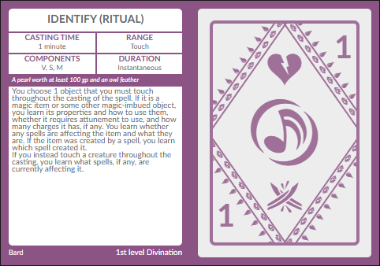

# Reactive Spell Card Designer



A Vue SPA based on jeyvi's "spellbook card generator"

Credit to [jeyvi](https://x.com/angrygazebo) for the overall card layout\
Credit to Lorc for creating the lovely [icons](https://www.reddit.com/r/IndieGaming/comments/ifmie/i_made_700_rpg_icons_free_for_use_for_your_game/)

# What is this?

This is a small, reactive, single-page application designed to mimic the functionality of the spell card designer created and maintained by jeyvi at https://hardcodex.ru/ and its beta at https://beta.hardcodex.ru/.

This is the result of a challenge I set for myself to learn something new, in a project that would be personally useful(-ish), and with a well-defined vision (because it's someone else's vision lol).

This is built from the ground up using Vue.js with Typescript, except for the card layout itself and the icons. For the card layout, I heavily modified the HTML and CSS from an export I had previously done from hardcodex, and converted this to Vue components and structure. The icons were created by Lorc.

# What isn't this?

This is not a replacement for hardcodex unless you personally really want it to be. You can checkout and use it locally, use a dockerized version (coming soon), or just do what we've been doing for the past 10+ years and head over to the original hardcodex site or its beta.

This is not a passion project of mine, and not something I intend to spend a substantial time to maintain. That's not to say I'm done with it, but I'm just aiming for the full set of features to more or less mirror that of hardcodex. Until it is at that point, expect updates.

This is not a role model for outstanding webapp code. I am an experienced career (mostly backend) developer, but chose this project in large part due to how foreign a lot of the technology was to me. I would expect someone with a lot of experience in frontend web application development to question some of my decsions. I am open to opportunities for learning--it's why I did this--but please be polite should you intend to share such questions.

# Okay but for real... what does it do?

This app allows you to design and then print cards for spells, items, or whatever you please. It is designed for use with tabletop RPGs, in particular D&D, but there is no inherent reason you can't use it for other things. You can customize the layout, load spell details from a file, and view each card individually before printing them all. The app is reactive, meaning changes you make are instantly reflected in the card preview.

## Card customization

The design consists of a choice in card color and a selection for each of the three icons on the back of the card. Changes to these selections are immediately reflected in the card preview.

Each set of selections is stored as its own design, and you can freely switch between designs using the selection item. You can also rename, copy, or delete card designs. Custom card designs persist between page reloads, but will be lost if you clear site data. You can also back up your custom designs to a JSON file or load designs from a backup. Please note that loading from a file will **replace** any custom designs already loaded.

The app comes preloaded with several sample designs, which cannot be renamed or deleted but can be copied. Changing the color or an icon in a default design will automatically create a copy and apply the edit to that copy instead.

## Spell list

Here you can view the items loaded into the app and select them in the selection box to preview each one instantly in the card preview. You can load a file to replace your spell list with the data from the file, or save a list to a file.

When printing a spell list, you can select paper size and orientation from your browser's print options. For letter or A4 paper, I would recommend portrait mode for single-sided cards and landscape mode for double-sided, but you can experiment and do what works best for you.

A limited set of markup is allowed inside the spell card itself, but only in the description area. This example card showcases each supported markup, and the Element Inspection in the browser's dev tools shows how to achieve them.

<details>
<summary>Example</summary>



</details>

# How do I use it?

## Using with Docker

Once there is a dockerized version, that will be an easier way to locally deploy and use this. I will add that information here once it is available. For now, you will have to build and deploy using Node.

## Using with Node

To deploy a local instance, you'll need the following:

- Git
- Node and NPM
- A browser

1. Clone this git repo using `git clone`
1. Run `npm install` from the project root (needed once per clone, and sometimes when the repo is updated)
1. Run `npm run build` (needed whenever the checkout is updated)
1. Run `npm run preview` (needed each time you want to actually deploy the build)\
   This should deploy the production version of the application to a local port shown in the terminal, e.g. `http://localhost:4173/`
1. Navigate your browser to the address shown in the terminal.

# I tried to use a CSV file I had and it didn't work

Yeah, sooo, bad news: I didn't make this support the exact format of the hardcodex CSV, because I could bring myself to fetch the materials requirement out of the description rather than as its own column.

Good news: you can fix your CSV with a bit of regex.

## The problem

The CSV format for hardcodex stores the required materials for a spell inside the description, like so:\
"level";"name";...;"duration";"(needed materials)description";...

I instead opted to put that in its own column, right before the description, like so:\
"level";"name";...;"duration";"needed materials";"description";...

## What it looks like

If your file has the hardcodex format, it will load into this designer and look like this:\


## The fix

Firstly, back up your file, making a copy to use on this tool while still being able to use the original on hardcodex.

If it's a small number of spells, feel free to change manually to match the new format. For bigger files, read on.

First, we need to add the extra column to all of the spells, with a really narsty braindead regex that I did not try too hard to simplify.
Simply open your file in an editor that supports regex find/replace with capture groups (I use Notepad++).\
Find: `([^;]*)(;)([^;]*)(;)([^;]*)(;)([^;]*)(;)([^;]*)(;)([^;]*)(;)([^;]*)(;)([^;]*)(;)("[^"]*")`\
Replace: `$1$2$3$4$5$6$7$8$9$10$11$12$13$14$14$15$16$17` (yes, $14 is in there twice, that's the only thing that results in a change)

Second, we need to move the needed materials, for spells that have them, into this new column, leaving it empty for spells that do not.\
Find: `;"\(([^\)]*)\)`\
Replace: `"$1";"`

Be sure to run these only once per spell! The regex may match and replace already-fixed spells, causing them to become not-so-fixed if run a second time.

Et voila!\


# What about this issue I found?

Feel free to post issues to the Issues section. Do not bother with anything that is a new feature request unless it is missing from core functionality or you plan to implement it yourself. Things that are most welcome to report include, but are not limited to:

- Broken functionality
- Accessibility issues
- "Something doesn't look right in X browser", where X is a _modern_ and widely-used browser (including mobile)--none of that IE crap or anything super customized

I will try to record missing functionality and update the list as I knock things down. Check the already existing issues before creating a new one, to avoid duplicates.

# Can I make changes?

Sure thing! If you want to include your changes in this repo, please see CONTRIBUTING.md for general contribution guidelines.

For actual development setup, see the below info, which was generated by the Vue.js project scaffolding.

<details>
<summary>Vue 3 setup</summary>

Guides, quickstart, tutorials, and documentation can also be found at Vue's [website](https://vuejs.org/guide)

## Recommended IDE Setup

[VSCode](https://code.visualstudio.com/) + [Volar](https://marketplace.visualstudio.com/items?itemName=Vue.volar) (and disable Vetur).

## Type Support for `.vue` Imports in TS

TypeScript cannot handle type information for `.vue` imports by default, so we replace the `tsc` CLI with `vue-tsc` for type checking. In editors, we need [Volar](https://marketplace.visualstudio.com/items?itemName=Vue.volar) to make the TypeScript language service aware of `.vue` types.

## Customize configuration

See [Vite Configuration Reference](https://vite.dev/config/).

## Project Setup

```sh
npm install
```

### Compile and Hot-Reload for Development

```sh
npm run dev
```

### Type-Check, Compile and Minify for Production

```sh
npm run build
```

### Run Unit Tests with [Vitest](https://vitest.dev/)

```sh
npm run test:unit
```

### Run End-to-End Tests with [Playwright](https://playwright.dev)

```sh
# Install browsers for the first run
npx playwright install

# When testing on CI, must build the project first
npm run build

# Runs the end-to-end tests
npm run test:e2e
# Runs the tests only on Chromium
npm run test:e2e -- --project=chromium
# Runs the tests of a specific file
npm run test:e2e -- tests/example.spec.ts
# Runs the tests in debug mode
npm run test:e2e -- --debug
```

### Lint with [ESLint](https://eslint.org/)

```sh
npm run lint
```

</details>
